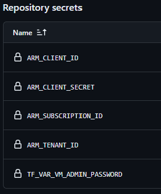

<div align="center" id="top"> 
  
</div>

<h1 align="center">Terraform + Azure</h1>


<p align="center">
  <a href="#dart-sobre">Sobre</a> &#xa0; | &#xa0; 
  <a href="#rocket-tecnologias">Tecnologias</a> &#xa0; | &#xa0;
  <a href="#white_check_mark-pre-requisitos">Pré-requisitos</a> &#xa0; | &#xa0;
  <a href="#checkered_flag-como-utilizar">Como utilizar</a> &#xa0; | &#xa0;
  <a href="https://github.com/luizpaese" target="_blank">Autor</a>
</p>

<br>

## :dart: Sobre ##

Este é um projeto criado para exercitar os conhecimentos adiquiridos com a ferramenta Terraform, criando recursos na Azure Cloud.<br>
Junto destas ferramentas, também foram utilizados o Ansible para configurar um serviço, e o GitHub Actions para orquestrar o provisionamento.


## :rocket: Tecnologias ##

The following tools were used in this project:

- [Terraform](https://www.terraform.io)
- [Azure](https://azure.microsoft.com)
- [Ansible](https://www.ansible.com)
- [GitHub Actions](https://github.com/features/actions)

## :white_check_mark: Pré-requisitos ##

É necessário ter o [Terraform](https://developer.hashicorp.com/terraform/install) e [Ansible](https://docs.ansible.com/ansible/latest/installation_guide/intro_installation.html#installing-and-upgrading-ansible-with-pip) instalados, e possuir uma conta na [Azure](https://azure.microsoft.com/pt-br/pricing/purchase-options/azure-account) e também no [GitHub](https://docs.github.com/pt/get-started/start-your-journey/creating-an-account-on-github).

Após criar a conta na Azure, é necessário criar uma entidade de serviço para que possamos obter as credenciais necessárias para criar a infraestrutura usando o Terraform. [Aqui](https://learn.microsoft.com/pt-br/azure/developer/terraform/authenticate-to-azure-with-service-principle?tabs=bash#create-a-service-principal) você encontra um passo a passo para criar uma entidade de serviço.<br>
Salve os valores retornados em um local seguro, eles serão utilizados a seguir.


## :checkered_flag: Como utilizar ##

Crie um repositório no GitHub, e vá até Settings > Security > Secrets and variables > Actions >  Secrets.<br>


Aqui será necessário adicionar 5 secrets necessárias para que o Actions rode corretamente. Elas estão listadas abaixo.
```bash
ARM_SUBSCRIPTION_ID # SUBSCRIPTION ID retornado ao criar uma entidade de serviço na Azure.
ARM_CLIENT_ID # APP IP retornado ao criar uma entidade de serviço na Azure.
ARM_CLIENT_SECRET # PASSWORD retornado ao criar uma entidade de serviço na Azure.
ARM_TENANT_ID # TENANT ID retornado ao criar uma entidade de serviço na Azure.
TF_VAR_VM_ADMIN_PASSWORD # Senha que será utilizada para acessar a máquina virtual criada. Necessário ter ao menos 1 letra maiúscula, minúscula, símbolo e número.
```

Ao fim, ficará da seguinte maneira:<br>


Por fim, o projeto pode ser clonado e copiado ao seu repositório.
A criação da infraestrutura deve ser feita automaticamente assim que o Actions concluir.


<br>
<br>
<br>

Made with :keyboard: by <a href="https://github.com/luizpaese" target="_blank">Luiz</a>
